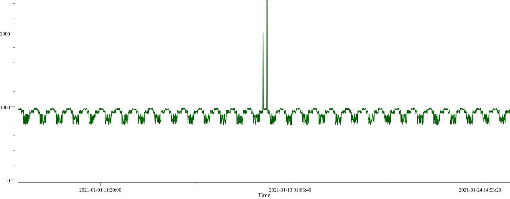

# Outliers Detector

### APP launch params:
    * -p: Server Port number (1-65535), default: 8080

### Supported outliers detection methods:
* **3-Sigmas method**

### Input and output data in dir stores/:
* **config.json** - DataSets store
* **reports.json** - Outliers detections result output


### Rest API
* GET /api/detect_outliers?stieId=*siteID* - return outliers detection result or DataSet graph
    - Request params: 
        - siteId `string` - **required**: Get DataSets for specify siteID
        - graph `bool` - **optional**: Return a dataset as a graph
    - Outliers response:
    ```
        [
            {
                "siteId": "brax",
                "OutliersDetectionMethod": "3-sigmas",
                "checkTimeStart": "2021-01-26 10:57:59",
                "checkTimeEnd": "2021-01-26 10:57:59",
                "TimeAgo": "30d",
                "TimeStep": "1d",
                "DateStart": "2020-12-27 13:57:59",
                "DateEnd": "2021-01-26 13:44:59",
                "Result": {
                    "Warnings": [
                        {
                            "OutlierPeriodStart": "2021-01-11 11:57:59",
                            "OutlierPeriodEnd": "2021-01-11 13:09:59",
                            "Metric": "Revenue",
                            "Attribute": ""
                        }
                    ],
                    "Alarms": [
                        {
                            "OutlierPeriodStart": "2021-01-11 17:51:59",
                            "OutlierPeriodEnd": "2021-01-11 19:01:59",
                            "Metric": "Revenue",
                            "Attribute": ""
                        }
                    ]
                }
            }
        ]
    ```
    - Graph response:
        

